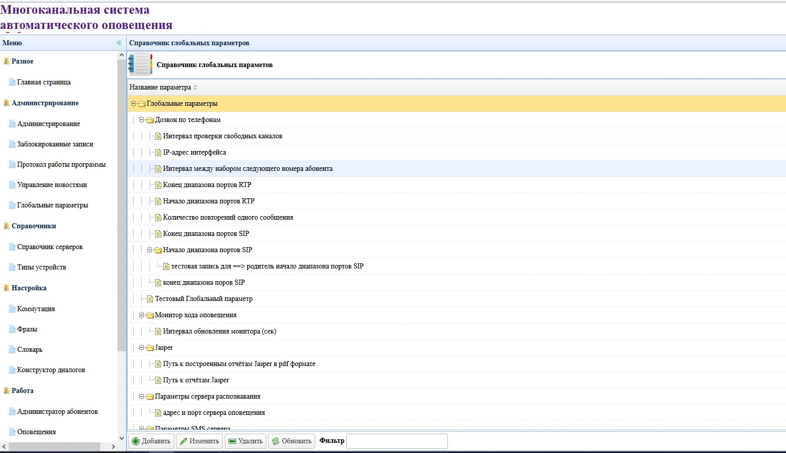

# Многоканальная система автоматического оповещения

## Автоматизированная система оповещения предназначенна для автоматизации процесса оперативного оповещения по телефонным каналам работников ведомства (компании, организации, предприятия) посредством передачи речевого, текстового или факсимильного сообщения на любой тип телефонов (городские, междугородние, сотовые и т.д.). Это решение, позволяет повысить эффективность работы самых разных служб, организаций, ведомств и структур.

### Достоинства системы оповещения:
- Простота установки и масштабируемость системы
- Высокая скорость оповещения
- Гарантированное оповещение абонентов с подтверждением факта оповещения
- Максимальная достоверность результатов оповещения

